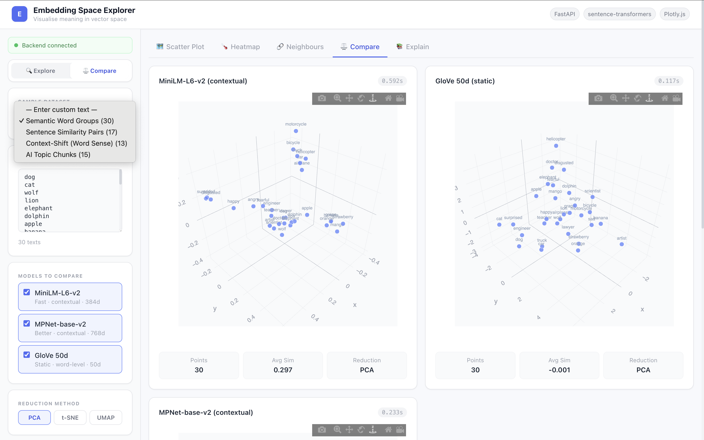

# Embedding Space Explorer 🧠

> An interactive AI visualisation product for exploring, comparing, and understanding text embeddings in 2D and 3D space.

<p align="center">
  
</p>

## 🎬 Demo Video

[](https://drive.google.com/file/d/1naDUCpqt5S8c6UYMI98BENHlnhcZHUMY/view?usp=sharing)

---

## ✨ Features

| Feature | Description |
|---|---|
| 🗺️ **2D & 3D Scatter Plot** | Interactive Plotly scatter with hover labels, click-to-inspect, category & cluster colouring |
| 🌡️ **Cosine Similarity Heatmap** | Pairwise similarity matrix for all input texts |
| 🔗 **Nearest Neighbours Panel** | Top-k most similar texts with similarity score bars |
| ⚖️ **Model Comparison** | Side-by-side scatter + timing for MiniLM, MPNet, GloVe |
| 🔀 **Context-Shift Demo** | Same word in different contexts — shows contextual vs static embedding difference |
| 🎯 **KMeans Clustering** | Automatic cluster overlay on scatter plots |
| 📚 **Educational Cards** | Built-in explanations of embeddings, cosine similarity, PCA/t-SNE/UMAP |
| 📦 **4 Demo Datasets** | Semantic words, sentence pairs, context-shift, AI documents |

---

## 🛠️ Tech Stack

**Backend**
- [FastAPI](https://fastapi.tiangolo.com/) — REST API
- [sentence-transformers](https://www.sbert.net/) — `all-MiniLM-L6-v2`, `all-mpnet-base-v2`
- GloVe via gensim downloader (static embeddings)
- scikit-learn — PCA, t-SNE, KMeans
- UMAP (optional)
- NumPy / Pandas

**Frontend**
- React 18 + TypeScript
- Vite 4
- Tailwind CSS 3
- Plotly.js — scatter, 3D, heatmap
- Zustand — state management
- Axios

---

## 🚀 Quick Start

```bash
git clone https://github.com/vamsikrishna2002/embedding-space-explorer.git
cd embedding-space-explorer
bash start.sh
```

Then open **http://localhost:5173** in your browser.

> The first startup downloads the MiniLM model (~90 MB). Subsequent starts are instant.

### Manual start

```bash
# Terminal 1 — Backend
cd backend
python3 -m venv .venv && source .venv/bin/activate
pip install -r requirements.txt
uvicorn app.main:app --reload

# Terminal 2 — Frontend
cd frontend
npm install
npm run dev
```

---

## 🏗️ Architecture

```
User Input
    │
    ▼
React Frontend (Vite + Tailwind + Plotly.js)
    │  POST /api/embed  or  POST /api/compare
    ▼
FastAPI Backend
    ├─ Embedding Service  ──▶  sentence-transformers / GloVe
    ├─ Similarity Service ──▶  Cosine similarity matrix + KNN + KMeans
    └─ Reduction Service  ──▶  PCA / t-SNE / UMAP
    │
    ▼  JSON response
Frontend Visualisations
    ├─ Scatter Plot (2D / 3D)
    ├─ Cosine Similarity Heatmap
    ├─ Nearest Neighbours Panel
    └─ Model Comparison (side-by-side)
```

---

## 📁 Project Structure

```
embedding-space-explorer/
├── backend/
│   ├── app/
│   │   ├── main.py                   # FastAPI app + CORS
│   │   ├── models/schemas.py         # Pydantic models
│   │   ├── routes/                   # embed, compare, datasets, health
│   │   ├── services/                 # embedding, reduction, similarity, pipeline
│   │   └── data/sample_datasets.py  # 4 built-in datasets
│   ├── tests/test_pipeline.py        # 6 unit tests (all passing ✅)
│   └── requirements.txt
│
├── frontend/
│   └── src/
│       ├── App.tsx
│       ├── components/
│       │   ├── layout/               # Header, ControlPanel, TabBar
│       │   ├── plots/                # ScatterPlot, Heatmap, CompareView
│       │   └── panels/               # NearestNeighbors, ExplainPanel
│       ├── hooks/useStore.ts         # Zustand state
│       ├── utils/api.ts              # Axios client
│       └── types/index.ts
│
├── docs/screenshots/                 # App screenshots
├── start.sh                          # One-command launcher
└── README.md
```

---

## 🔌 API Reference

| Method | Path | Description |
|---|---|---|
| `GET` | `/health` | Server health + loaded models |
| `GET` | `/api/datasets` | List all demo datasets |
| `GET` | `/api/datasets/{name}` | Fetch dataset items |
| `POST` | `/api/embed` | Run full pipeline for one model |
| `POST` | `/api/compare` | Run pipeline for multiple models |

Interactive docs → **http://localhost:8000/docs**

---

## 🧪 Tests

```bash
cd backend
source .venv/bin/activate
pytest tests/ -v
```

All 6 tests pass ✅

---

## 📖 Key Concepts

- **Embeddings** — dense numeric vectors representing semantic meaning of text
- **Cosine Similarity** — measures angle between vectors; `1.0` = identical, `0.0` = unrelated
- **PCA** — linear reduction, preserves global variance, fast
- **t-SNE** — non-linear, preserves local clusters, slower
- **UMAP** — balances local + global structure, faster than t-SNE
- **Contextual vs Static** — MiniLM/MPNet shift "bank" depending on sentence; GloVe does not

---

## 👤 Author

**Vamsi Krishna**
- GitHub: [@vamsikrishna2002](https://github.com/vamsikrishna2002)
- Email: vamsikrishna80940@gmail.com
