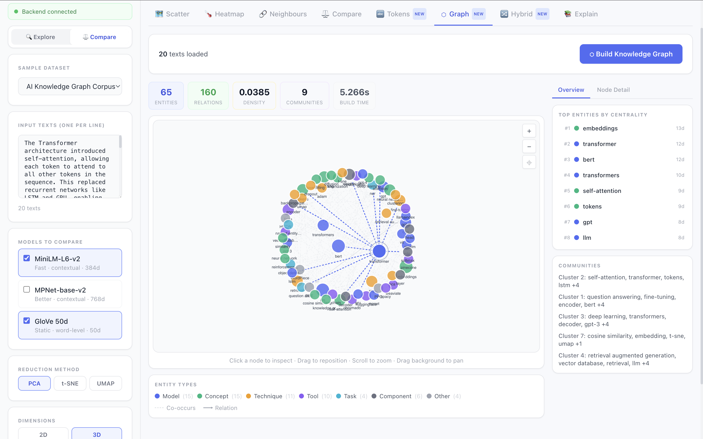

# Neural Concept Explorer

> An interactive AI engineering dashboard that connects **tokenization**, **knowledge graphs**, and **embedding space** in one unified visualization — showing how raw text becomes structured meaning.

<p align="center">
  
</p>

> **What you see above:** The Knowledge Graph tab built from the *AI Knowledge Graph Corpus*. **65 entities** extracted (models, concepts, techniques, tools, tasks), **160 edges** from co-occurrence and relation patterns, **9 communities** detected via greedy modularity, and **graph density 0.0385**. Node size reflects frequency; color reflects entity type. Right panel shows top entities by centrality and community groupings. Build time: 5.266s including embedding generation.

---

## The Core Idea

Most AI tools show one thing at a time — a scatter plot, or a graph, or a tokenizer output. This project shows **all three layers at once** and lets you compare them:

| Layer | Question it answers |
|---|---|
| **Tokens** | How does the tokenizer split this sentence? Which are subwords? |
| **Knowledge Graph** | Which entities exist? How are they structurally connected? |
| **Embeddings** | Which entities are semantically similar in vector space? |
| **Hybrid** | Where do graph structure and embedding space agree — and disagree? |

The **Hybrid view** is the core insight: two entities can be *directly connected in the graph* (functional relationship) but *far apart in embedding space* (semantically different). Or *semantically close in embedding space* but *not connected in the graph* — a hidden relationship the text didn't explicitly state.

---

## Features

### Token Explorer
- Per-sentence token breakdown with color-coded tiles — normal, subword (`##`), and special tokens
- Token IDs shown beneath each tile
- BERT (WordPiece), GPT-2 (BPE), and RoBERTa tokenizer support
- Corpus-level token frequency bar chart across all loaded texts
- Token co-occurrence heatmap

### Knowledge Graph
- Entity extraction from an AI/ML domain dictionary + spaCy NER
- Relation extraction via sentence patterns: `uses`, `is_a`, `trained_on`, `combines`, `requires`, `improves`, and more
- Co-occurrence edges for implicit connections within documents
- Force-directed SVG graph with **drag, pan, zoom** — no external graph library
- Node color by entity type: Model · Concept · Technique · Tool · Dataset · Task · Component · Company
- Node size by frequency; click any node to inspect its full detail
- Graph analytics: degree centrality, betweenness, community detection (greedy modularity)
- Per-node panel: graph neighbors with relation labels + semantic embedding neighbors

### Embedding Space
- MiniLM-L6-v2, MPNet-base-v2, GloVe 50d
- 2D / 3D scatter via PCA, t-SNE, or UMAP
- Pairwise cosine similarity heatmap
- Nearest-neighbour inspection on click
- Side-by-side model comparison

### Hybrid Analysis
- Select any entity: see **Graph Only** (structural, not semantic) · **Overlap** (both agree) · **Semantic Only** (close in meaning, not connected)
- Auto-generated insight text explaining what each mismatch means

---

## Architecture

```
raw text
    │
    ├── Tokenizer (BERT / GPT-2 / RoBERTa)
    │       → token tiles · subword breakdown · frequency stats · co-occurrence
    │
    ├── Entity Extractor (AI domain dict + spaCy NER)
    │       → named entities: models, concepts, techniques, tools, tasks
    │
    ├── Relation Extractor (regex sentence patterns)
    │       → typed edges: uses · is_a · trained_on · combines · requires …
    │
    ├── Knowledge Graph (NetworkX)
    │       → nodes (entities) + edges (relations + co-occurrence)
    │       → centrality · betweenness · community detection
    │
    └── Embedding Model (sentence-transformers)
            → dense vectors per entity
            → cosine similarity · nearest neighbours
            → PCA / t-SNE / UMAP for 2D / 3D scatter
```

---

## Tech Stack

| Layer | Technology |
|---|---|
| Backend | Python · FastAPI · uvicorn |
| Embeddings | sentence-transformers (MiniLM, MPNet) · GloVe via gensim |
| Tokenizer | HuggingFace `transformers` — BERT, GPT-2, RoBERTa |
| Graph | NetworkX · spaCy |
| Frontend | React 18 · TypeScript · Tailwind CSS · Vite |
| Charts | Plotly.js — scatter, heatmap, bar |
| Graph Vis | Custom SVG force-directed simulation |
| State | Zustand |

---

## Quick Start

```bash
git clone https://github.com/vamsikrishna2002/neural-concept-explorer.git
cd neural-concept-explorer
bash start.sh
```

Open **http://localhost:5173**

The script automatically:
- Creates a Python virtualenv and installs all dependencies
- Downloads the spaCy English model if missing
- Starts the backend on port 8000 and the frontend on port 5173

### Manual start

```bash
# Terminal 1 — Backend
cd backend
python3 -m venv .venv && source .venv/bin/activate
pip install -r requirements.txt
python -m spacy download en_core_web_sm
uvicorn app.main:app --reload --port 8000

# Terminal 2 — Frontend
cd frontend
npm install
npm run dev
```

---

## Usage Guide

1. Open `http://localhost:5173`
2. **Load a dataset** — select *AI Knowledge Graph Corpus* for the richest graph experience
3. **Tokens tab** → paste any sentence, click *Tokenize*; or click *Analyze Corpus Tokens* for frequency and co-occurrence charts
4. **Graph tab** → click *Build Knowledge Graph* to extract entities and relations; click any node to inspect neighbors
5. **Scatter / Heatmap** → click *Generate* to compute embeddings and see the vector space
6. **Hybrid tab** → after building the graph, select any entity to compare graph neighbors vs semantic neighbors

---

## API Endpoints

| Method | Endpoint | Description |
|---|---|---|
| GET | `/health` | Backend status and loaded models |
| POST | `/api/embed` | Generate embeddings + scatter coords |
| POST | `/api/compare` | Compare two models side by side |
| POST | `/api/tokens/tokenize` | Tokenize a single sentence |
| POST | `/api/tokens/corpus-stats` | Token frequency + co-occurrence for a corpus |
| POST | `/api/graph/build` | Build knowledge graph from texts |
| POST | `/api/graph/node-detail` | Full detail for a graph node |
| GET | `/api/datasets` | List built-in datasets |
| GET | `/api/datasets/{name}` | Fetch a dataset |

Interactive API docs: **http://localhost:8000/docs**

---

## Built-in Datasets

| Dataset | Description |
|---|---|
| AI Knowledge Graph Corpus | 20 rich AI/ML paragraphs — best for graph and hybrid views |
| AI Topic Chunks | 15 AI topic paragraphs for embedding clusters |
| Semantic Word Groups | 30 words across animals, fruits, vehicles, emotions, professions |
| Sentence Similarity Pairs | Paraphrase pairs showing semantic closeness |
| Context-Shift (Word Sense) | Same word in different contexts — contextual vs static embeddings |

---

## Project Structure

```
neural-concept-explorer/
├── backend/
│   ├── app/
│   │   ├── main.py                    # FastAPI app + CORS
│   │   ├── routes/
│   │   │   ├── embed.py               # Embedding endpoints
│   │   │   ├── tokenize.py            # Token endpoints
│   │   │   ├── graph.py               # Knowledge graph endpoints
│   │   │   ├── datasets.py
│   │   │   └── health.py
│   │   ├── services/
│   │   │   ├── embedding_service.py   # sentence-transformers + GloVe
│   │   │   ├── tokenizer_service.py   # HuggingFace tokenizers
│   │   │   ├── graph_service.py       # Entity extraction + NetworkX
│   │   │   ├── pipeline_service.py    # Embed → reduce → cluster
│   │   │   ├── reduction_service.py   # PCA / t-SNE / UMAP
│   │   │   └── similarity_service.py  # Cosine similarity + KMeans
│   │   └── data/
│   │       └── sample_datasets.py     # Built-in datasets
│   └── requirements.txt
├── frontend/
│   └── src/
│       ├── App.tsx
│       ├── components/
│       │   ├── layout/                # Header, ControlPanel, TabBar
│       │   ├── plots/                 # ScatterPlot, Heatmap, GraphView
│       │   │                          # TokenView, KnowledgeGraphTab
│       │   │                          # HybridView, CompareView
│       │   └── panels/                # NearestNeighbors, Explain
│       ├── hooks/useStore.ts          # Zustand global state
│       ├── types/index.ts             # TypeScript interfaces
│       └── utils/api.ts               # Axios API client
├── docs/screenshots/
│   └── graph-tab-demo.png
├── start.sh                           # One-command launcher
└── README.md
```

---

## Key Concepts

- **Tokenization** — text is split into subword units before any model sees it; BERT uses WordPiece, GPT-2 uses BPE
- **Embeddings** — dense numeric vectors representing semantic meaning; similar concepts cluster nearby
- **Cosine Similarity** — measures the angle between vectors; `1.0` = identical direction, `0.0` = orthogonal
- **Knowledge Graph** — entities as nodes, relationships as typed edges; symbolic structure
- **Hybrid Analysis** — comparing structural graph neighbors vs semantic embedding neighbors reveals gaps between what text *says* explicitly and what it *means* semantically
- **PCA** — linear reduction, preserves global variance, fastest
- **t-SNE / UMAP** — non-linear, better for revealing local cluster structure

---

## Author

**Vamsi Krishna**
- GitHub: [@vamsikrishna2002](https://github.com/vamsikrishna2002)
- Email: vamsikrishna80940@gmail.com

---

## License

MIT
